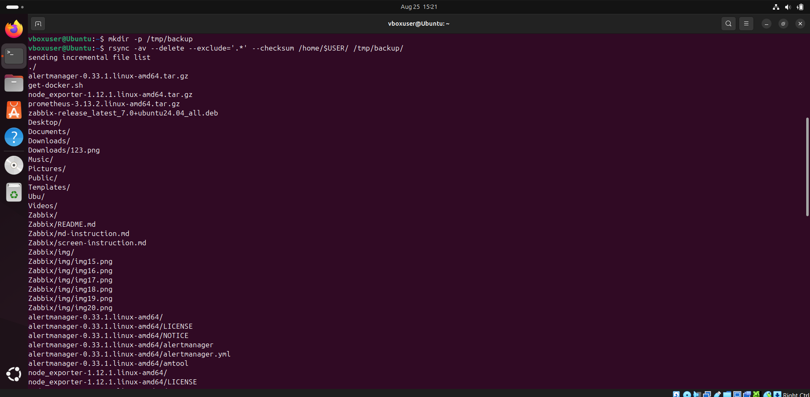
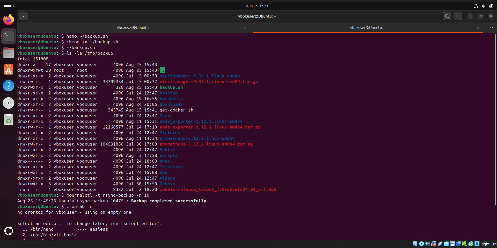
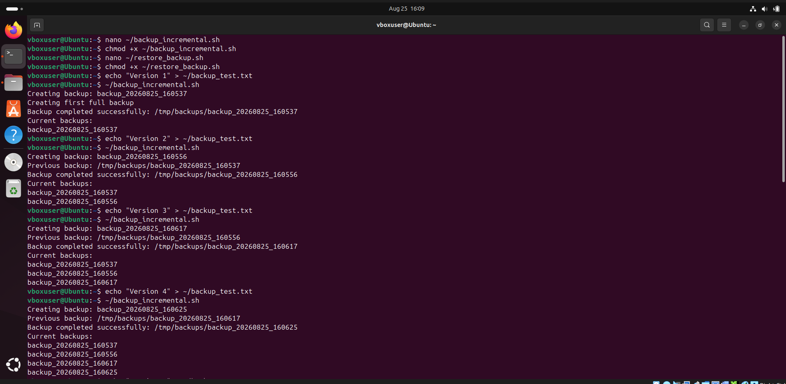
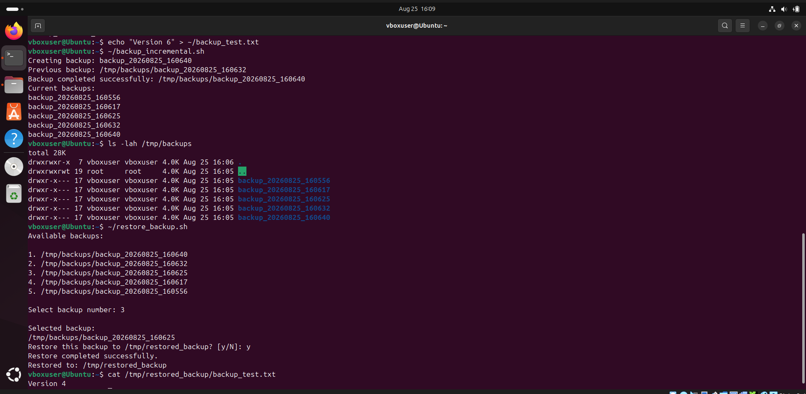

# Домашнее задание: Резервное копирование с помощью rsync   Илембетов Василь Ражапович

## 🇷🇺 Описание

Данное домашнее задание посвящено настройке резервного копирования домашней директории пользователя с использованием утилиты `rsync` и планировщика `cron`.

### Структура проекта

```
Backup/
├── img/          # Изображения (скриншоты для отчёта)
├── scripts/      # Скрипты для выполнения заданий
└── README_RU.md  # Этот файл
```

---

## Задание 1: Команда rsync для зеркального бэкапа

Составить команду `rsync`, которая создаёт зеркальную копию домашней директории пользователя в директорию `/tmp/backup`.

**Требования:**
- Исключить из синхронизации все директории, начинающиеся с точки (скрытые)
- Принудительно вычислять хэш-суммы для всех файлов, даже если время модификации и размер идентичны в источнике и приёмнике

**Решение:**

```bash
rsync -a --delete --exclude='.*' --checksum ~ /tmp/backup
```

**Разбор параметров:**

| Параметр | Описание |
|----------|----------|
| `-a` | Режим архива (сохраняет права, время модификации, ссылки и т.д.) |
| `--delete` | Удаляет файлы в приёмнике, которых нет в источнике (зеркальное копирование) |
| `--exclude='.*'` | Исключает все файлы и директории, начинающиеся с точки |
| `--checksum` | Использует проверку по хэш-сумме вместо времени модификации и размера |
| `~` | Исходная директория (домашняя) |
| `/tmp/backup` | Целевая директория |

**Результат выполнения:**



---

## Задание 2: Регулярное резервное копирование через cron

Написать скрипт и настроить задачу на регулярное резервное копирование домашней директории пользователя с помощью `rsync` и `cron`.

**Требования:**
- Резервная копия должна быть полностью зеркальной
- Резервная копия должна создаваться раз в день
- В системном логе должна появляться запись об успешном или неуспешном выполнении операции
- Резервная копия размещается локально, в директории `/tmp/backup`

### Скрипт: `scripts/backup.sh`

```bash
#!/bin/bash

BACKUP_DIR="/tmp/backup"
SOURCE_DIR="$HOME"
LOG_FILE="/var/log/backup.log"

rsync -a --delete --exclude='.*' --checksum "$SOURCE_DIR" "$BACKUP_DIR" 2>&1 | tee -a "$LOG_FILE"

if [ $? -eq 0 ]; then
    echo "$(date): Backup completed successfully" >> "$LOG_FILE"
else
    echo "$(date): Backup failed" >> "$LOG_FILE"
fi
```

### Настройка cron

Откройте редактор cron-задач:

```bash
crontab -e
```

Добавьте строку для ежедневного выполнения (например, в 2:00 ночи):

```
0 2 * * * /path/to/scripts/backup.sh
```

**Содержимое crontab:**

```
0 2 * * * /home/vboxuser/scripts/backup.sh >> /var/log/backup.log 2>&1
```

**Результат работы:**



---

## Задание 3: Инкрементное резервное копирование и управление бэкапами

Написать скрипт для локального инкрементного резервного копирования домашней директории пользователя с помощью `rsync` и управлением старыми копиями.

**Требования:**
- Локальное инкрементное резервное копирование домашней директории пользователя с помощью `rsync`
- Удаление старых резервных копий (сохранять только последние 5 штук)
- Скрипт управления: выбрать резервную копию и восстановить данные

### Принцип работы

Инкрементное копирование реализовано с помощью ключа `--link-dest`, который создаёт жёсткие ссылки на неизменённые файлы из предыдущей резервной копии. Это позволяет экономить место на диске, поскольку копируются только файлы, которые изменились с момента последнего бэкапа.

```
backup_20240101_120000/   ← полная копия
backup_20240102_120000/   ← только изменённые файлы, остальные — жёсткие ссылки на первый бэкап
backup_20240103_120000/   ← только изменённые файлы, остальные — жёсткие ссылки на второй бэкап
```

### Скрипт бэкапа: `scripts/backup_incremental.sh`

```bash
#!/bin/bash

BACKUP_BASE="/tmp/backup_incremental"
SOURCE_DIR="$HOME"
MAX_BACKUPS=5

# Создание директории для бэкапов, если не существует
mkdir -p "$BACKUP_BASE"

# Текущая метка времени
TIMESTAMP=$(date +%Y%m%d_%H%M%S)
BACKUP_NAME="backup_${TIMESTAMP}"
BACKUP_PATH="${BACKUP_BASE}/${BACKUP_NAME}"

# Находим предыдущий бэкап для --link-dest
LATEST_BACKUP=$(ls -1d ${BACKUP_BASE}/backup_* 2>/dev/null | sort | tail -n 1)

# Шаг 1: Инкрементное копирование с помощью rsync
if [ -n "$LATEST_BACKUP" ] && [ -d "$LATEST_BACKUP" ]; then
    echo "Создание инкрементной копии на основе: ${LATEST_BACKUP}"
    rsync -a --delete --exclude='.*' --link-dest="$LATEST_BACKUP" "$SOURCE_DIR/" "$BACKUP_PATH/" 2>&1
else
    echo "Создание полной копии (первый бэкап)"
    rsync -a --delete --exclude='.*' "$SOURCE_DIR/" "$BACKUP_PATH/" 2>&1
fi

if [ $? -eq 0 ]; then
    echo "$(date): Backup ${BACKUP_NAME} completed successfully."
else
    echo "$(date): Backup ${BACKUP_NAME} failed!"
    exit 1
fi

# Шаг 2: Удаление старых бэкапов (оставляем только последние MAX_BACKUPS)
BACKUP_COUNT=$(ls -1d ${BACKUP_BASE}/backup_* 2>/dev/null | wc -l)

if [ "$BACKUP_COUNT" -gt "$MAX_BACKUPS" ]; then
    REMOVE_COUNT=$((BACKUP_COUNT - MAX_BACKUPS))
    echo "Удаление ${REMOVE_COUNT} старых бэкапов..."
    ls -1d ${BACKUP_BASE}/backup_* | sort | head -n "$REMOVE_COUNT" | while read OLD_BACKUP; do
        echo "  Удаляется: ${OLD_BACKUP}"
        rm -rf "$OLD_BACKUP"
    done
fi

echo "Бэкап ${BACKUP_NAME} завершён успешно."
```

### Скрипт управления: `scripts/restore_backup.sh`

```bash
#!/bin/bash

BACKUP_BASE="/tmp/backup_incremental"

# Список доступных бэкапов
list_backups() {
    echo "Доступные резервные копии:"
    echo "--------------------------"
    ls -1td ${BACKUP_BASE}/backup_* 2>/dev/null | nl
}

# Восстановление из выбранной копии
restore_backup() {
    local BACKUP_NAME=$1
    local RESTORE_TARGET=${2:-$HOME}

    local BACKUP_PATH="${BACKUP_BASE}/${BACKUP_NAME}"

    if [ ! -d "$BACKUP_PATH" ]; then
        echo "Ошибка: резервная копия '${BACKUP_NAME}' не найдена!"
        exit 1
    fi

    echo "Восстановление из копии: ${BACKUP_NAME}"
    echo "Целевая директория: ${RESTORE_TARGET}"
    echo ""

    read -p "Вы уверены? Текущие данные могут быть перезаписаны. (y/N): " CONFIRM
    if [ "$CONFIRM" != "y" ] && [ "$CONFIRM" != "Y" ]; then
        echo "Отменено."
        exit 0
    fi

    rsync -av --delete "$BACKUP_PATH/" "$RESTORE_TARGET/" 2>&1

    if [ $? -eq 0 ]; then
        echo ""
        echo "Успешно восстановлено из: ${BACKUP_NAME}"
    else
        echo ""
        echo "Ошибка восстановления!"
        exit 1
    fi
}

# Главное меню
case "$1" in
    list)
        list_backups
        ;;
    restore)
        if [ -z "$2" ]; then
            echo "Использование: $0 restore <номер_копии> [путь_восстановления]"
            echo ""
            echo "Сначала выполните: $0 list"
            echo "чтобы увидеть список доступных копий."
            exit 1
        fi
        list_backups
        echo ""
        BACKUP=$(ls -1td ${BACKUP_BASE}/backup_* 2>/dev/null | sed -n "${2}p")
        if [ -n "$BACKUP" ]; then
            BACKUP_NAME=$(basename "$BACKUP")
            restore_backup "$BACKUP_NAME" "${3:-$HOME}"
        else
            echo "Ошибка: копия с номером $2 не найдена."
            exit 1
        fi
        ;;
    *)
        echo "Использование: $0 {list|restore <номер> [путь]}"
        echo ""
        echo "  list              - показать список резервных копий"
        echo "  restore N         - восстановить копию №N в домашнюю директорию"
        echo "  restore N /путь   - восстановить копию №N в указанную директорию"
        ;;
esac
```

### Использование

```bash
# Запуск инкрементного бэкапа
./scripts/backup_incremental.sh

# Список доступных бэкапов
./scripts/restore_backup.sh list

# Восстановить копию №1 в домашнюю директорию
./scripts/restore_backup.sh restore 1

# Восстановить копию №2 в указанную директорию
./scripts/restore_backup.sh restore 2 /tmp/restore_test
```

**Результат работы скриптов:**





---

## License

Это домашнее задание университета.
