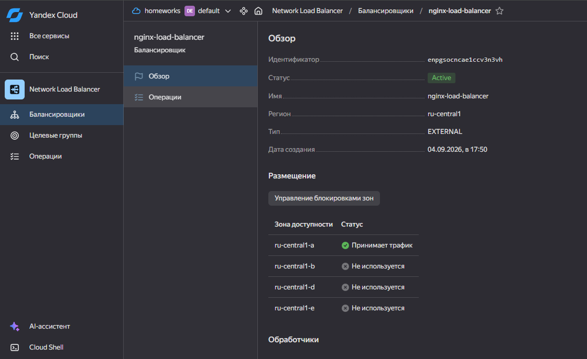
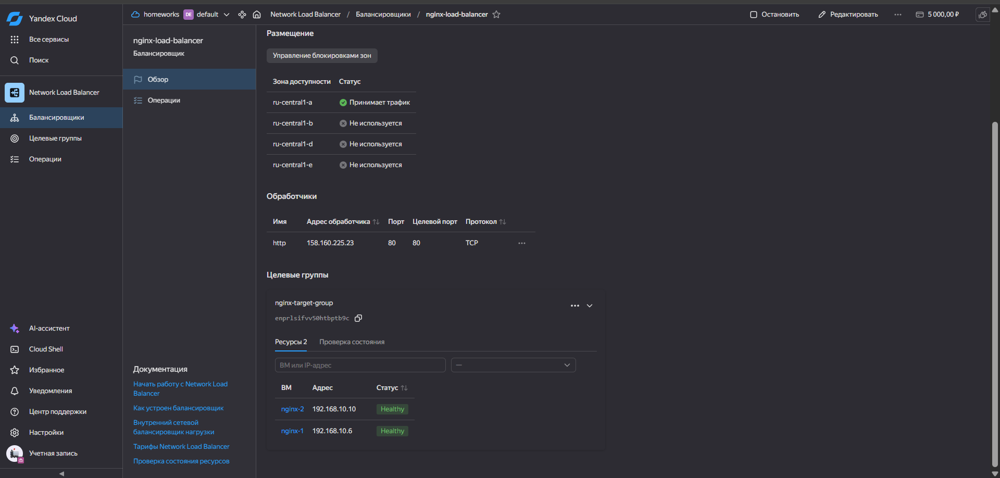
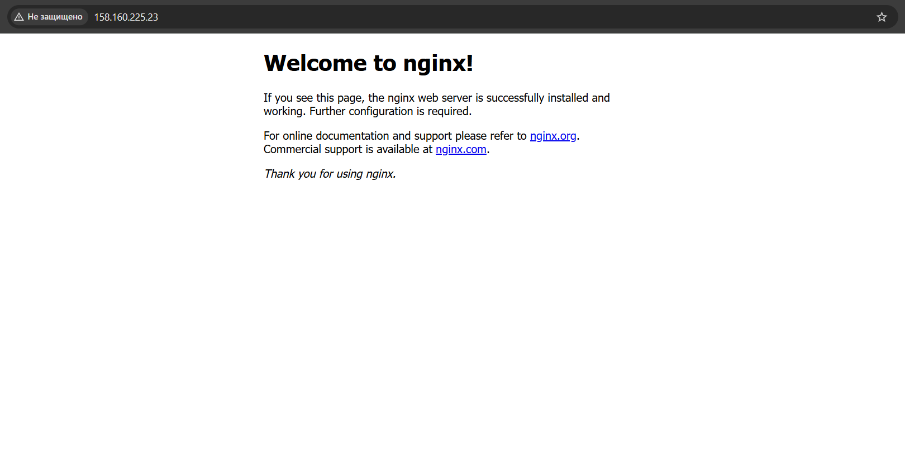

# Cloud Server Fault Tolerance   Илембетов Василь Ражапович

## Цель работы

Создать отказоустойчивую веб-инфраструктуру в Yandex Cloud с использованием Terraform: развёртывание двух идентичных виртуальных машин с установленным Nginx, подключение их к Target Group, настройка Network Load Balancer (NLB) с HTTP health check и проверка работоспособности распределённого сервиса.

## Архитектура

Инфраструктура разворачивается в одном VPC-сегменте Yandex Cloud:

```
Internet
    │
    ▼
┌─────────────────────┐
│  Network Load Balancer  │  (порт 80, HTTP health check → /)
└─────────────────────┘
    │
    ▼
┌─────────────────────────┐
│  Target Group              │
│  ┌─────────────────────┐ │
│  │  nginx-1 (Nginx)    │ │
│  │  nginx-2 (Nginx)    │ │
│  └─────────────────────┘ │
└─────────────────────────┘
```

### Сетевая топология

- **VPC-сеть** (`netology-lb-network`)
- **Подсеть** (`netology-lb-subnet`, `192.168.10.0/24`, зона `ru-central1-a`)
- Две ВМ с внешним NAT-адресом

## Выполненные шаги

### 1. Создание двух идентичных ВМ через Terraform `count`

В `main.tf` используется ресурс `yandex_compute_instance` с параметром `count = 2`, что создаёт две одинаковые виртуальные машины (`nginx-1` и `nginx-2`) с 2 ядрами CPU, 2 ГБ памяти и 10 ГБ диском на базе образа Ubuntu 22.04.

### 2. Установка Nginx через `cloud-init`

Конфигурация `user-data` для обеих ВМ берётся из файла `cloud-init.yaml`. Скрипт выполняет обновление пакетов, устанавливает Nginx, включает автозапуск и запускает сервис.

### 3. Создание Target Group

Ресурс `yandex_lb_target_group` динамически собирает все созданные ВМ (через `for_each = yandex_compute_instance.nginx`) и регистрирует их в группе таргетов с привязкой к подсети.

### 4. Создание Network Load Balancer

Ресурс `yandex_lb_network_load_balancer` создаёт балансировщик нагрузки с TCP-слушателем на порту 80, который перенаправляет трафик на таргеты по тому же порту 80.

### 5. HTTP health check на порт 80

В конфигурации NLB настроен healthcheck с HTTP-опциями: проверка пути `/` на порту 80. Если хотя бы один таргет проходит проверку, балансировщик считается здоровым.

### 6. Передача трафика с LB на ВМ по порту 80

Трафик от клиентов поступает на внешний IP-адрес Network Load Balancer, который распределяет запросы между двумя ВМ в Target Group по порту 80.

### 7. Проверка работоспособности

После развёртывания инфраструктуры на каждой ВМ доступен Nginx. При обращении к внешнему IP-адресу балансировщика возвращается стандартная welcome-страница Nginx.

### 8. Итоговый результат

Успешно развёрнута отказоустойчивая инфраструктура в Yandex Cloud: два бэкенда за Network Load Balancer с health check, обеспечивающие доступность веб-сервиса при отказе отдельного таргета.

## Файлы проекта

- [main.tf](scripts/main.tf) — основная конфигурация: провайдер, сеть, подсеть, ВМ, Target Group, NLB
- [variables.tf](scripts/variables.tf) — переменные (cloud_id, folder_id, zone, SSH-ключ)
- [outputs.tf](scripts/outputs.tf) — выходные данные: внутренние и внешние IP ВМ, IP балансировщика
- [cloud-init.yaml](scripts/cloud-init.yaml) — скрипт инициализации: установка и запуск Nginx

## Результаты

### Network Load Balancer



### Target Group



### Проверка Nginx на ВМ


