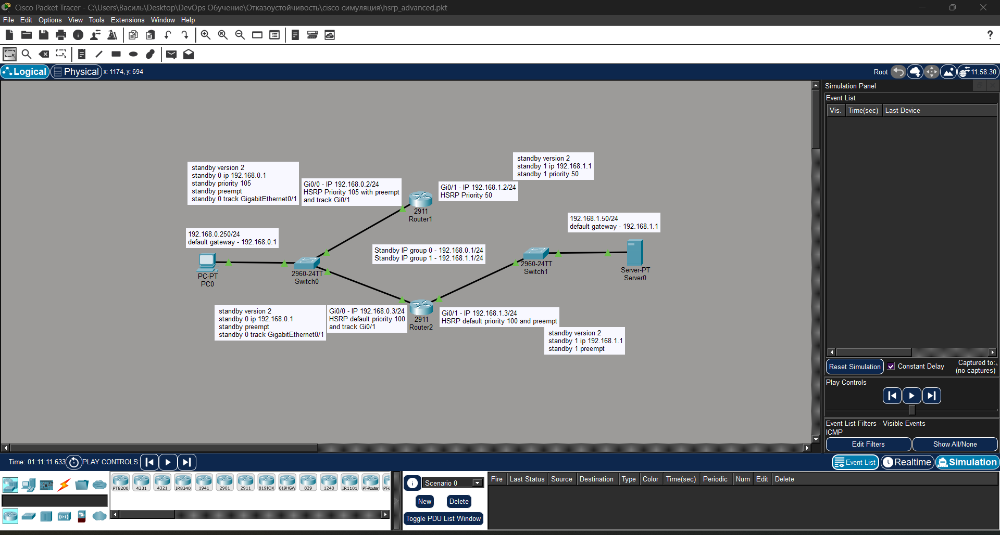
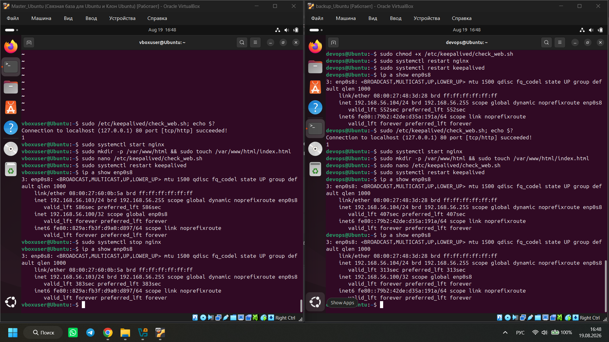

# Homework 1: Disaster Recovery and Keepalived

**Student:** Ilembetov Vasil Razhapovich

---

## Assignment 1. HSRP and Cisco Packet Tracer

### Solution Description

The first HSRP group has been configured with interface tracking for `Gi0/0`. When the interface goes down, the router's priority is decreased, causing failover to the backup router.

Network topology file:

- [Cisco Packet Tracer Topology (pkt)](./1/hsrp_advanced_my.pkt)

### Router Configuration Process



---

## Assignment 2. Keepalived + Bash Health Check Script

### How It Works

The Bash script `check_web.sh` performs two checks:
1. **Port 80 check** — uses `nc -z localhost 80` to verify the web server (nginx) is accessible.
2. **File existence check** — confirms `/var/www/html/index.html` exists.

If either check fails, the script exits with code 1 (`exit 1`), which Keepalived interprets as a service failure.

The `vrrp_script` section in `keepalived.conf` defines the `check_web` parameter, which:
- Runs the script every 3 seconds (`interval 3`).
- Marks the node as down after 2 consecutive failures (`fall 2`).
- Restores status after 2 successful checks (`rise 2`).

The tracking script is attached in `vrrp_instance VI_1` via `track_script { check_web }`, ensuring automatic failover of the floating IP to the backup node when the web server becomes unavailable.

### Bash Script

```bash
#!/bin/bash
# Check port 80 (nginx)
nc -z localhost 80 || exit 1
# Check that index.html exists
[ -f /var/www/html/index.html ] || exit 1
exit 0
```

### Keepalived Configuration

```ini
vrrp_script check_web {
    script "/etc/keepalived/check_web.sh"
    interval 3    # Check every 3 seconds
    fall 2        # Mark as down after 2 failures
    rise 2        # Mark as up after 2 successes
}

vrrp_instance VI_1 {
    state MASTER
    interface enp0s8      # Replace with your interface name (ip a)
    virtual_router_id 51  # Must be the same on both nodes
    priority 101          # Higher than the backup
    advert_int 1

    authentication {
        auth_type PASS
        auth_pass 12345   # Shared password for both nodes
    }

    virtual_ipaddress {
        192.168.56.100    # Floating (virtual) IP
    }

    track_script {
        check_web
    }
}
```

### Floating IP Failover


