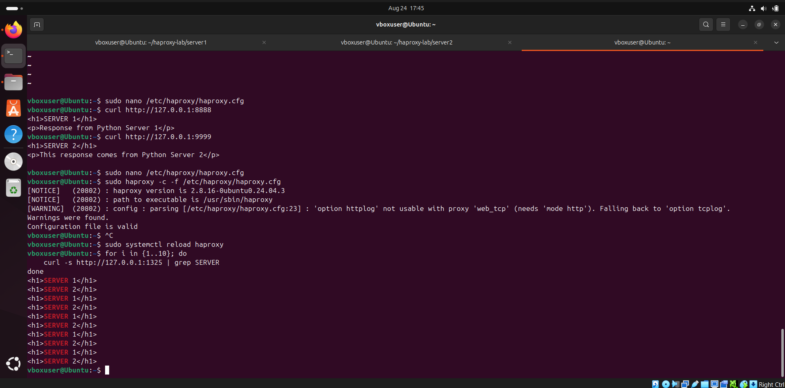
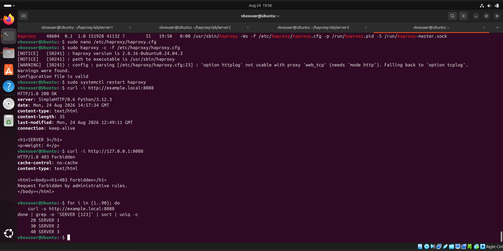

# Лабораторная работа: HAProxy + Nginx   Илембетов Василь Ражапович

Данный проект содержит материалы и конфигурации для домашней работы по настройке балансировки нагрузки с использованием HAProxy и Nginx.

## Структура проекта

```
├── haproxy-lab/           # Тестовые Python-серверы
│   ├── server1/           # Сервер 1 (вес 2)
│   ├── server2/           # Сервер 2 (вес 3)
│   └── server3/           # Сервер 3 (вес 4)
├── scripts/               # Конфигурационные файлы
│   ├── haproxy.cfg        # Конфигурация HAProxy
│   └── Nginx              # Конфигурация Nginx
└── img/                   # Скриншоты выполнения заданий
    ├── 1.png
    ├── 2.png
    └── 3.png
```

---

## Задание 1: Балансировка Round-Robin на 4 уровне (TCP)

**Цель:** Запустить два простых Python-сервера на разных портах и настроить HAProxy для балансировки на 4 уровне OSI (TCP) с алгоритмом round-robin.

### Описание

- Запущены два Python-сервера на разных портах.
- HAProxy настроен на балансировку TCP-запросов между серверами.
- Используется алгоритм round-robin для равномерного распределения нагрузки.

### Проверка

Для проверки отправляем запросы к HAProxy и наблюдаем чередование ответов от разных серверов.



---

## Задание 2: Weighted Round-Robin на 7 уровне (HTTP)

**Цель:** Запустить три Python-сервера и настроить HAProxy для балансировки HTTP-трафика на 7 уровне с различными весами серверов.

### Описание

- Запущены три Python-сервера на разных портах.
- HAProxy настроен на балансировку HTTP-запросов на 7 уровне OSI.
- Веса серверов:
  - Сервер 1 — вес **2**
  - Сервер 2 — вес **3**
  - Сервер 3 — вес **4**
- HAProxy принимает и перенаправляет только трафик, адресованный домену **example.local**.

### Проверка

- Запросы с указанием домена `example.local` корректно перенаправляются на бэкенды.
- Запросы без домена отклоняются.



---

## Задание 3*: Связка HAProxy + Nginx

**Цель:** Настроить связку Nginx + HAProxy, где Nginx раздает статические файлы, а динамические запросы передаются HAProxy.

### Описание

- **Nginx** слушает порт 80 и:
  - Раздает статические файлы (`.jpg`, `.jpeg`, `.png`) напрямую из каталога `/var/www/images/`.
  - Все остальные запросы проксирует на HAProxy (`127.0.0.1:8089`).
- **HAProxy** принимает запросы и распределяет их между двумя Python-серверами по алгоритму round-robin.
- В каталоги `/var/www/` добавлены тестовые изображения для проверки раздачи статических файлов.

### Проверка

- Запрос `.jpg`-файлов обслуживается Nginx напрямую.
- Запросы остальных ресурсов передаются через HAProxy на Python-серверы.


---

## Конфигурационные файлы

### HAProxy

Конфигурационный файл: [`scripts/haproxy.cfg`](scripts/haproxy.cfg)

Включает:
- Frontend с ACL для фильтрации по домену `example.local`
- Backend с Weighted Round-Robin (веса 2, 3, 4)
- Frontend для TCP-балансировки на 4 уровне
- Frontend и backend для HTTP-балансировки Python-серверов
- Статистическую страницу по адресу `http://<host>:8888/stats`

### Nginx

Конфигурационный файл: [`scripts/Nginx`](scripts/Nginx)

Включает:
- Локацию для раздачи статических изображений (`.jpg`, `.jpeg`, `.png`) из `/var/www/images/`
- Проксирующую локацию `/` на HAProxy (`127.0.0.1:8089`)

---

## Запуск

### 1. Запуск тестовых Python-серверов

```bash
# Сервер 1 — порт 8888
python3 -m http.server 8888 --directory haproxy-lab/server1

# Сервер 2 — порт 9999
python3 -m http.server 9999 --directory haproxy-lab/server2

# Сервер 3 — порт 7777
python3 -m http.server 7777 --directory haproxy-lab/server3
```

### 2. Размещение тестовых изображений

```bash
sudo mkdir -p /var/www/images
sudo cp img/*.jpg /var/www/images/ 2>/dev/null || true
```

### 3. Запуск Nginx

```bash
sudo cp scripts/Nginx /etc/nginx/sites-available/default
sudo nginx -t && sudo systemctl restart nginx
```

### 4. Запуск HAProxy

```bash
sudo cp scripts/haproxy.cfg /etc/haproxy/haproxy.cfg
sudo systemctl reload haproxy
```

### 5. Проверка

| Задача | URL / Команда |
|--------|---------------|
| Round-Robin TCP | `curl http://127.0.0.1:1325` |
| Weighted HTTP | `curl -H "Host: example.local" http://127.0.0.1:8088` |
| Статистика HAProxy | `http://127.0.0.1:8888/stats` |
| Статика Nginx | `http://127.0.0.1/image.jpg` |
| Прокси через HAProxy | `http://127.0.0.1/` |
