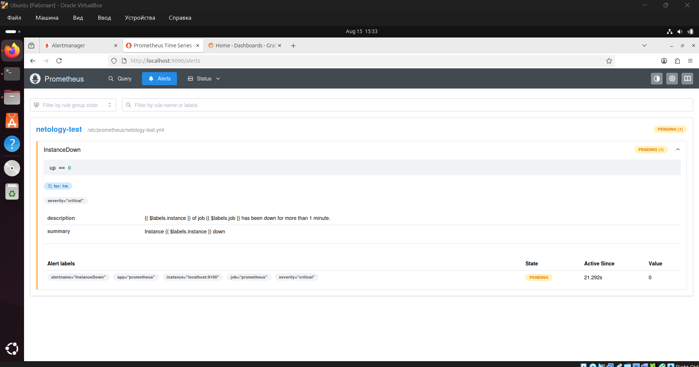
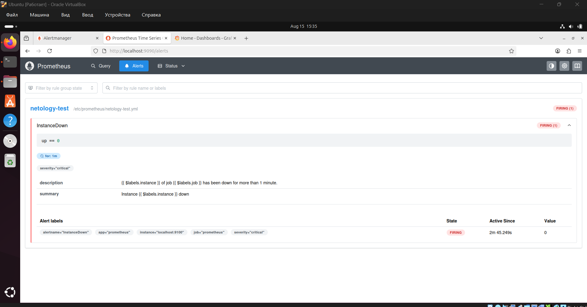
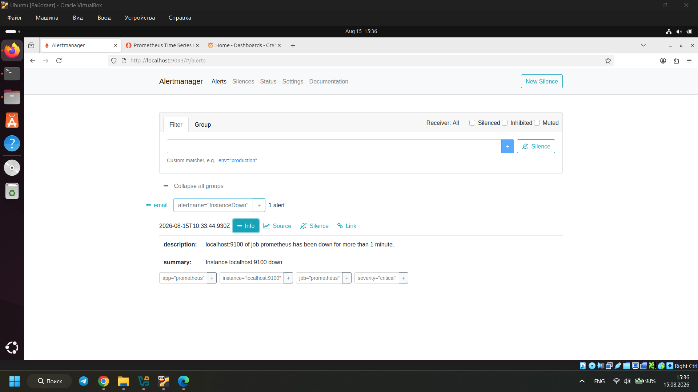
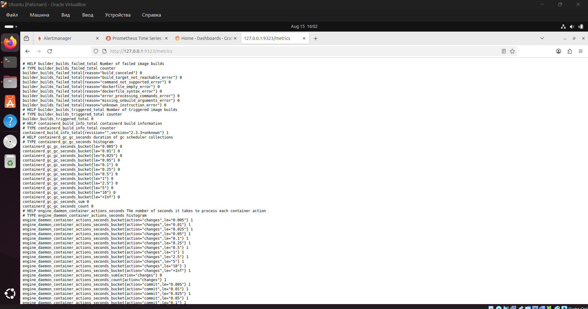
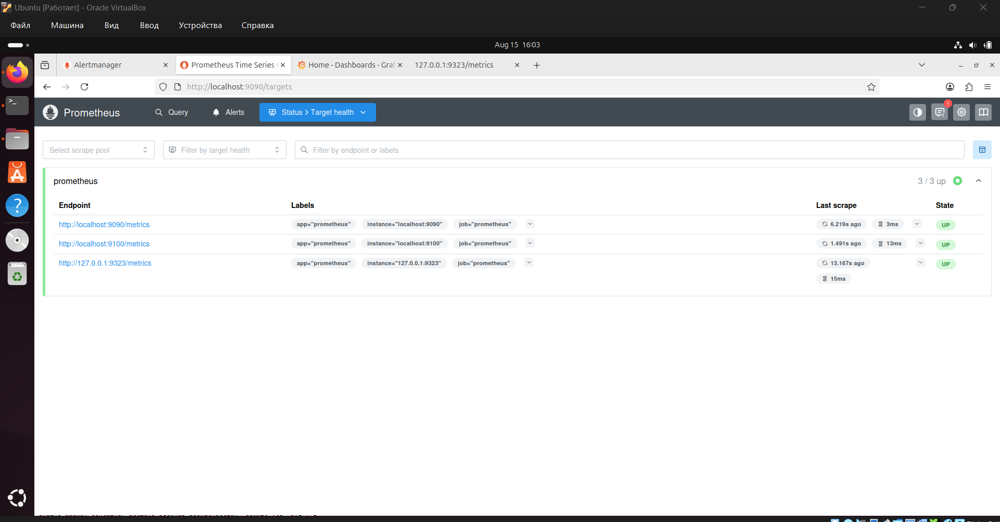

# Домашнее задание к занятию "Prometheus. Часть 2" Илембетов Василь Ражапович

---

## Задание 1

### Настройка правила оповещения в Prometheus

**Описание:** Создать правило алертинга в Prometheus, которое будет срабатывать при определённых условиях, и убедиться, что правило правильно интерпретируется системой.

**Скриншот статуса Pending:**

---

## Задание 2

### Установка Alertmanager и интеграция с Prometheus

**Описание:** Скачать и установить, настроить его конфигурацию с каналами оповещения и интегрировать с Prometheus для отправки алертов.

**Скриншот статуса Firing в Prometheus и активного правила в Alertmanager:**

---

## Задание 3

### Активация экспортёра метрик в Docker и подключение к Prometheus

**Описание:** Запустить Docker контейнер, включить экспортёра метрик в Docker: создать и открыть конфигурационный файл демона, прописать endpoint. Добавить как target в Prometheus (в yaml файл) для сбора метрик.

**Скриншот открытого endpoint экспортёра:**

**Скриншот списка Targets в Prometheus:**

