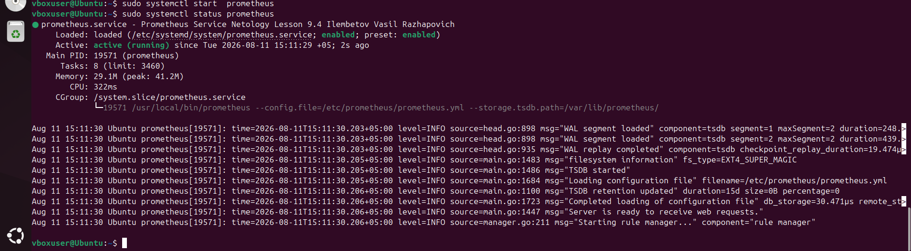
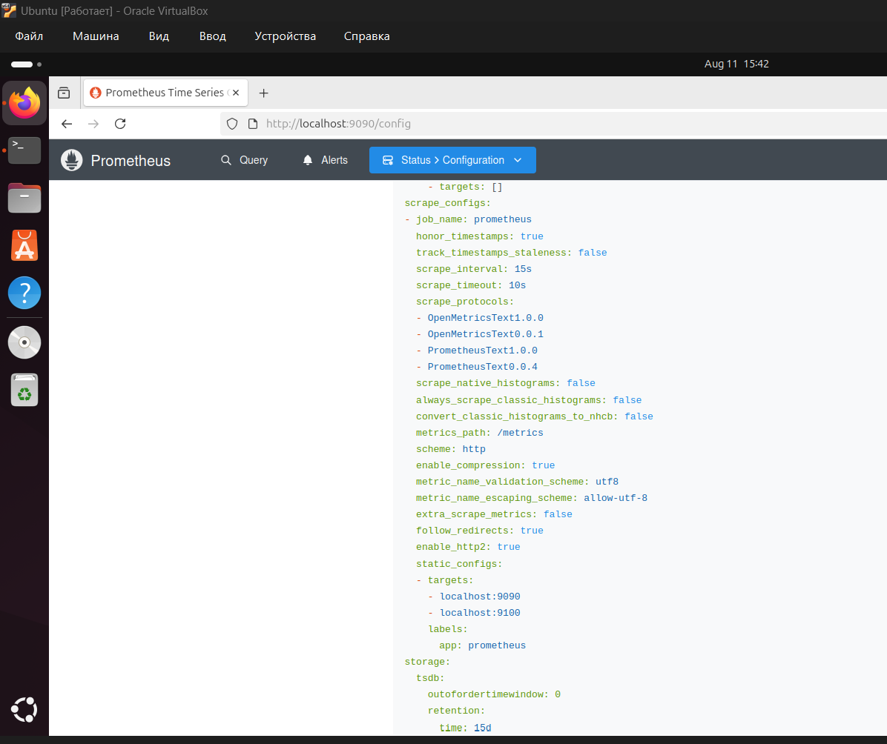
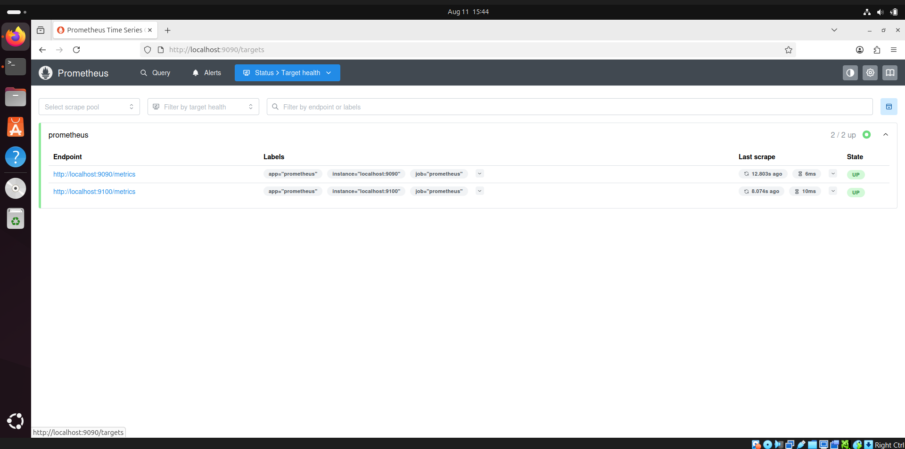
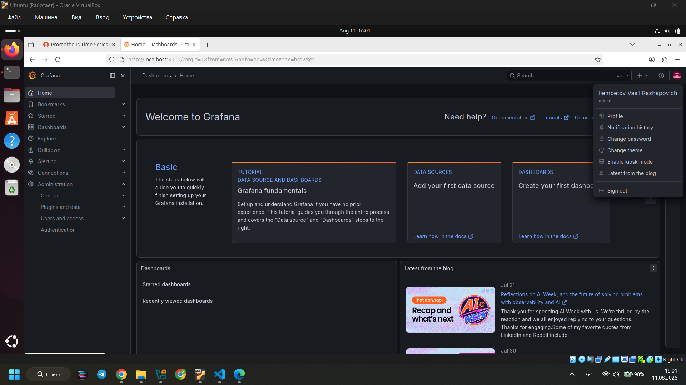

# Homework for the Lesson «Prometheus Monitoring System»

**Completed by:** Ilembetov Vasily Rajapovich

---

## Assignment 1. Installing Prometheus

**Description:** Prometheus has been installed, the prometheus user has been created and the system service has been configured.

> The screenshot shows `systemctl status prometheus` with the line `prometheus.service — Prometheus Service Netology Lesson 9.4 — Ilembetov Vasily Rajapovich`.

---

## Assignment 2. Installing Node Exporter

**Description:** Node Exporter has been installed and the system service has been configured.

> The screenshot shows `systemctl status node-exporter` with the line `node-exporter.service — Node Exporter Netology Lesson 9.4 — Ilembetov Vasily Rajapovich`.

---

## Assignment 3. Connecting Node Exporter to Prometheus

**Description:** The `node-exporter` target has been added to `prometheus.yml` and the service has been restarted.

> The configuration screenshot shows the **Status > Configuration** tab with the added `node-exporter` target.
> The endpoints screenshot shows the **Status > Targets** tab with at least two endpoints (prometheus and node-exporter).

---

## Assignment 4. Installing Grafana*

**Description:** Grafana has been installed.

> The screenshot shows the Grafana interface (upper right corner when hovering over the user icon with the full name).

---

## Assignment 5. Integrating Grafana and Prometheus*

**Description:** Prometheus has been connected as a Data Source in Grafana.

> The screenshot shows the integrated Data Source or Grafana dashboard with Prometheus connected.
