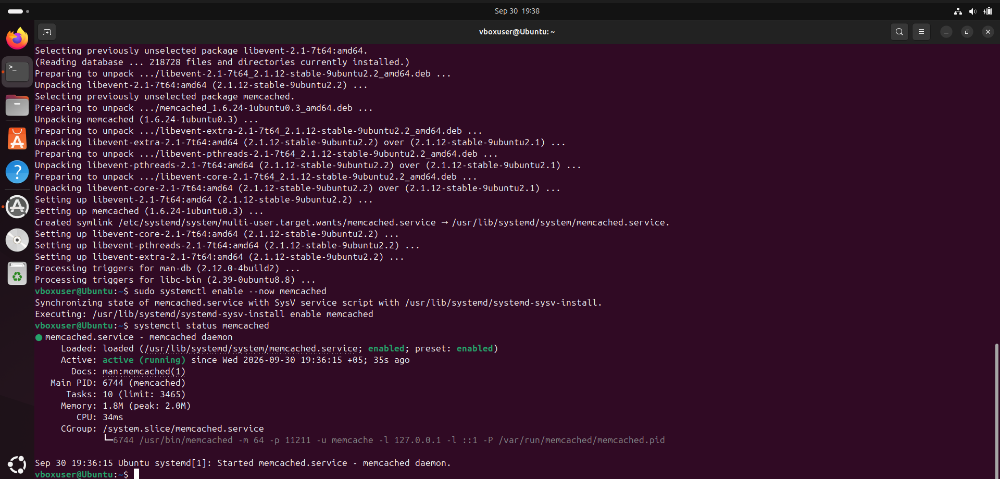
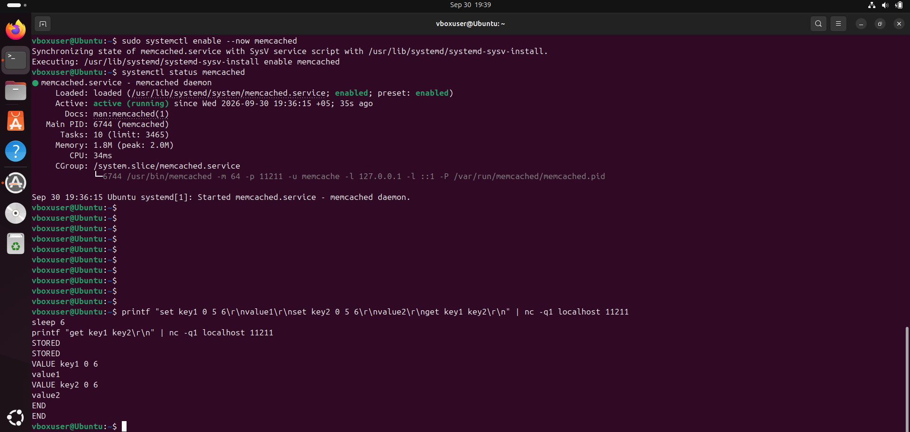
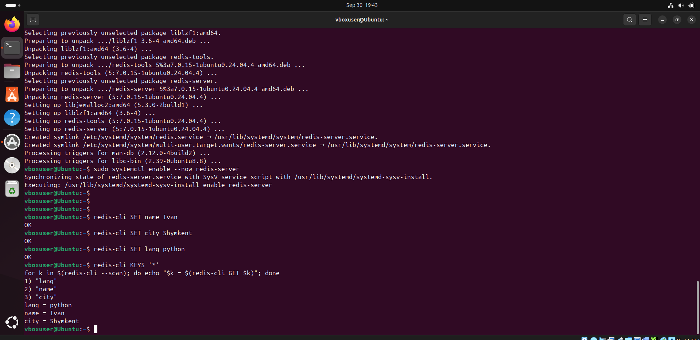
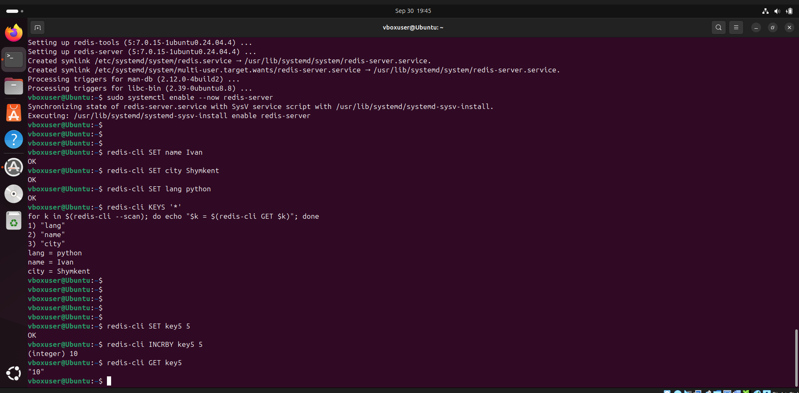

# Redis & Memcached

Student: Ilembetov Vasil Rajapovich

## Task 1. Caching

Caching stores the result of an expensive operation in a fast storage (usually RAM) so that you don't have to repeat that operation on every request. Here are the problems it solves:

- **High database load.** The same queries (e.g., a product list or the homepage) are executed thousands of times. The result is cached, and the database is only queried on a cache miss.
- **Slow responses.** Reading from memory takes fractions of a millisecond, while a complex SQL query with JOINs and aggregations can take seconds. Caching significantly reduces response time.
- **Heavy computations.** Reports, template rendering, image processing, and ML model responses can be computed once and reused.
- **Slow or rate-limited external APIs.** Caching reduces the number of calls to third-party services (currency rates, weather, geocoding), saves quotas and money, and helps if the service is temporarily unavailable.
- **Traffic spikes.** During user surges (sales, viral news), the cache handles the majority of requests, preventing the backend from crashing.
- **Session storage.** User sessions in Redis or Memcached are accessible to all application servers, which is convenient for horizontal scaling.
- **Rate limiting.** Counters with TTL in Redis allow you to limit, for example, the number of login attempts per minute.
- **Network and bandwidth load.** CDN and browser caches serve static assets (images, JS, CSS) from the nearest node, offloading the main server.

> **The downside of caching:** data can become stale, so you need TTLs and an invalidation strategy.

---

## Task 2. Memcached

Installation and startup of memcached:

```bash
sudo apt update
sudo apt install -y memcached netcat-openbsd
sudo systemctl enable --now memcached
systemctl status memcached
```

The screenshot should show the line `Active: active (running)`.



---

## Task 3. TTL-based Deletion in Memcached

Write keys with a TTL of 5 seconds and verify that they are deleted after 6 seconds:

```bash
printf "set key1 0 5 6\r\nvalue1\r\nset key2 0 5 6\r\nget key1 key2\r\n" | nc -q1 localhost 11211
sleep 6
printf "get key1 key2\r\n" | nc -q1 localhost 11211
```

Command format: `set <key> <flags> <TTL in seconds> <value length in bytes>`. `value1` is 6 bytes, hence `6` is used everywhere.

The first `get` will return both values, and the second, after 6 seconds, will return only `END`. This proves that the keys have been deleted.



---

## Task 4. Writing Data to Redis

Installation and startup of Redis:

```bash
sudo apt install -y redis-server
sudo systemctl enable --now redis-server
```

Writing keys:

```bash
redis-cli SET name Ivan
redis-cli SET city Shymkent
redis-cli SET lang python
```

Reading all keys and values:

```bash
redis-cli KEYS '*'
for k in $(redis-cli --scan); do echo "$k = $(redis-cli GET $k)"; done
```

The second loop will output all keys along with their values. If there are other people's keys in the database, you can limit the output, for example with `--scan --pattern 'name*'`, or use `redis-cli MGET name city lang`.



---

## Task 5*. Working with Numbers (optional)

```bash
redis-cli SET key5 5
redis-cli INCRBY key5 5
redis-cli GET key5
```

`INCRBY` will return `10`, and `GET` will show `"10"`. Redis doesn't have a separate `int` type: the value is stored as a string, and `INCR`/`INCRBY` interpret it as a number.


